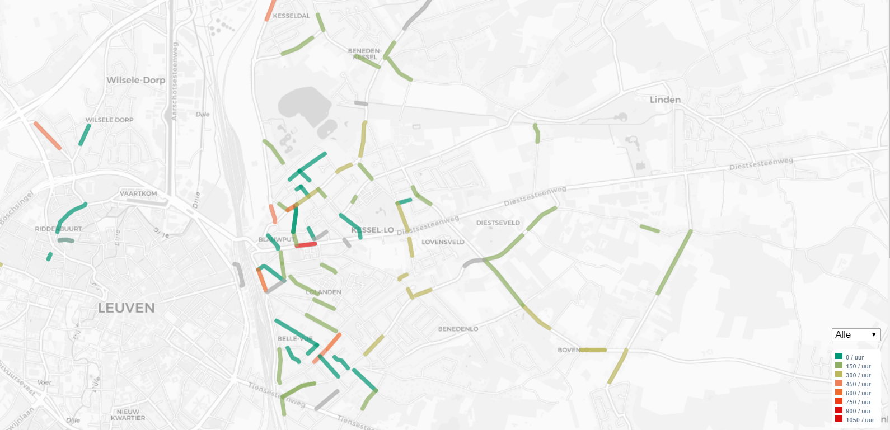

# Telraam

**Telraam is an affordable and yet intricate traffic-monitoring network built around a cluster of low-cost sensors and a central server. It is a collaboration between [Transport & Mobility Leuven (TML)](https://www.tmleuven.be/en/), [Mobiel 21](https://www.mobiel21.be/), and [Waanz.in](https://waanz.in/), that is financed by the Smart Mobility Belgium Grant of the Federal Government.**

Precisely measured traffic volumes are essential for transport-related studies. Within the Telraam-project, we develop an integrated application based on low-cost hardware, a central database and processing server, and a public online platform allowing citizens to contibute to automated real-time traffic counts.

:office::hotel::deciduous_tree::house:

:runner::bike::car::articulated_lorry:

:house::deciduous_tree::office::hotel:

Pedestrians, cyclists, cars, and heavy vehicles are each counted separately when passing in front of the low-resolution camera (without actual images being stored). The resulting traffic data can be used to perform traffic engeneering studies. This way, citizens and citizen platforms get objective data, allowing them to engage in a dialogue based on actual data with their local government. This could result in actions such as for instance a modification of the driving direction, the redesign of the public space, an improvent of the cycling conditions, or a modification of the parking infrastructure.

TML develops the architecture, the hardware setup and the software for the sensor, and uses the resulting traffic count data in a pilot case in [Kessel-Lo, Belgium](https://www.google.com/maps/place/Kessel-Lo,+3010+Leuven/) (Leuven, Belgium) to showcase the possibilities of the application to both citizens as well as local governments. In the pilot case in Kessel-Lo, we roll out a local network of 100 counting points. Furthermore, we provide 100 additional sensors to set up small networks in other places accross Flanders. 

By the end of this project, we expect the number of sensors to grow organically beyond the original volume, and that independent applications emerge that make use of the traffic count data.

For more information (in Dutch) and the live traffic map, please visit the [Telraam website](https://telraam.net/).

## Telraam on the Raspberry Pi

The Telraam software is initially provided as an image that can be written to an SD-card (minimum required size is 8 GiB); it can be found at the [Telraam website](https://telraam-api.net/telraam-sd-image.zip) (the compressed image is about 2 GiB in size). When the image is booted for the first time, it automatically resizes the main partition to span the entire SD card. From then on, when the Pi boots, it tries to connect to the local wifi network, and starts its image processing and data transfers to our servers. However, if no network is known or available, the Pi automatically becomes an access point. A user can then connect to the Pi using another device (smartphone, computer, tablet, ...), go to 192.168.254.1, and fill in the SSD and password of a local Wifi network.  

In this repository we make the various scripts that Telraam uses available:
* Resizing of the partition: [pishrink.sh](./Shrink%20SD%20image/pishrink.sh)
* The control loop that switches between access point mode and wifi mode: [telraam_ap_control_loop.py](./Access%20point/telraam_ap_control_loop.py)
* The camera stream that is shown when the Pi is in access point mode: [telraam_camera_stream.py](./Access%20point/telraam_camera_stream.py)
* The welcome page on the Pi when in access point mode: [index.php](./Access%20point/index.php)
* The monitoring script that performs the image processing and data transfers: [telraam_monitoring.py](./Image%20processing/telraam_monitoring.py)
* The remote updating functionality: [telraam_auto_updater_cron.py](./Remote%20updating/telraam_auto_updater_cron.py)
* And finally some household tools: [telraam_show_mac_address.py](./Misc/telraam_show_mac_address.py)

The goal of this - besides being completely transparent and honest about our methods - is to provide an opportunity to the public to improve upon (parts) of the original scripts developed at Transport & Mobility Leuven (TML, Belgium), and help the Telraam network reach its maximum potential. Please make sure to observe our CC BY-SA license.

The main image processing is done in [telraam_monitoring.py](./Image%20processing/telraam_monitoring.py). Below you will find a list of [dependencies](https://github.com/Telraam/Telraam-RPi#dependencies) that are needed for the script to run, a link to a detailed [documentation](https://github.com/Telraam/Telraam-RPi#detailed-documentation) that explains some ideas behind the script in a more detailed way than how it is done by comments placed inside the script itself, and a list of [development goals](https://github.com/Telraam/Telraam-RPi#development-goals) that we would like the community to pay special attention to.

#### Dependencies

- Python 3.6 (and some standard libraries)
- OpenCV 3.4.3
- Numpy
- Pandas

#### Detailed documentation

There is extensive documentation in the form of end-of-the-line comments in the code, and there is a detailed documentation that explains some of the practices and ideas behind the code that is available in **[code_documentation.md](./code_documentation.md)**

#### Development goals

- [ ] Advanced (Bayesian) tracking (that is capable of better handling special cases, such as object overlaps, merging and separating objects, etc.).
- [ ] Compression of the (binary) data when transferring to the server.
- [ ] Properly parallelise observing and tracking loops (assuming the Bayesian tracking can be made real-time; during actively observing the contour data from the previous observing window could be tracked and transferred, saving valuable uptime).
- [ ] Better background calculation logic that can better handle situations with traffic standstills.
- [ ] Go wild, anything that can improve the speed and quality of image processing, object matching and tracking, and data transfer.
